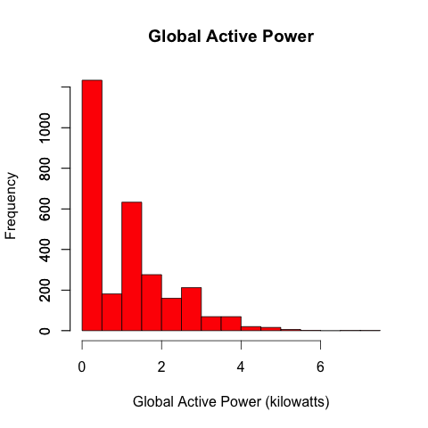
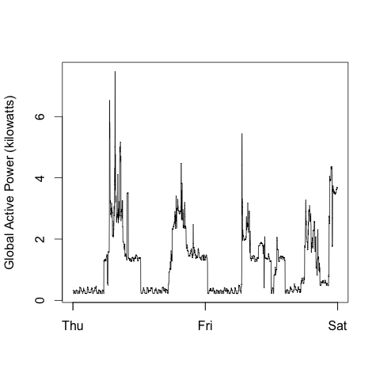
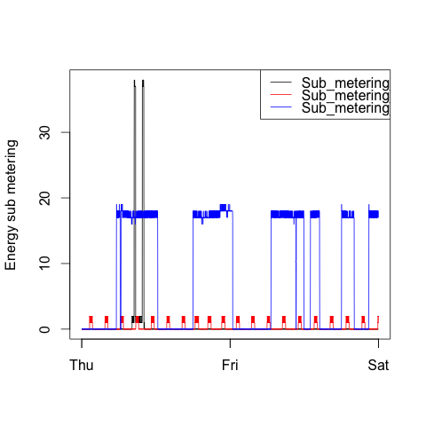
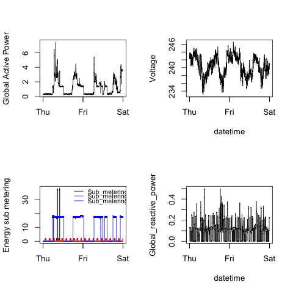

## Introduction

This assignment was completed as part of the Exploratory Data Analysis course offered by Johns Hopkins Bloomberg School of Public Health through <a href="http://www.coursera.com">Coursera</a>.

My assignment was to reconstruct plots the instructor had created using the 
base plot system in R.

This assignment uses data from the <a href="http://archive.ics.uci.edu/ml/">UC Irvine Machine Learning Repository</a>, a popular repository for machine learning datasets. In particular, I was asked to usethe "Individual householdelectric power consumption Data Set" which has been made availible by the instructors on the course web site: <a              href="https://d396qusza40orc.cloudfront.net/exdata%2Fdata%2Fhousehold_power_consumption.zip">Electric power consumption</a> [20Mb]

- <b>Code</b>: Contains the R scripts used to process, clean, and generate the required figures.

- <b>Plots</b>: Contains the plots generated by the R code, as well as the original figures created by the instructor.

## Plots
Below is the code used to create the plot after the data had been process and cleaned, and the resulting plot.

### Plot 1

<pre><code> hist(plot_data$Global_active_power, col = "red",
     xlab = "Global Active Power (kilowatts)",
     main = "Global Active Power")
    axis(side=2, at=seq(0,1200, 200), labels=seq(0,1200, 200))
</code></pre>

### Plot 2

<pre><code>plot(plot_data$Global_active_power~plot_data$DateTime,
    xlab = "",
    ylab = "Global Active Power (kilowatts)",
    type = "l")
</code></pre>

### Plot 3

<pre><code>plot(plot_data$Sub_metering_1~plot_data$DateTime,
    xlab = "",
    ylab = "Energy sub metering",
    type = "l")

    lines(plot_data$DateTime,plot_data$Sub_metering_2, col = "red")
    lines(plot_data$DateTime,plot_data$Sub_metering_3, col = "blue")

    legend("topright", legend = c("Sub_metering_1","Sub_metering_2","Sub_metering_3"),
       lty = c(1,1), col = c("black", "red", "blue"))
</code></pre>

### Plot 4

<pre><code># Set global graph parameters

par(mfrow = c(2,2))

# Figure 1

plot(plot_data$Global_active_power ~ plot_data$DateTime,
    xlab = "",
    ylab = "Global Active Power",
    type = "l")

# Figure 2

plot(plot_data$Voltage ~ plot_data$DateTime,
    xlab = "datetime",
    ylab = "Voltage",
    type = "l")

# Figure 3

plot(plot_data$Sub_metering_1~plot_data$DateTime,
    xlab = "",
    ylab = "Energy sub metering",
    type = "l")

lines(plot_data$DateTime,plot_data$Sub_metering_2, col = "red")
lines(plot_data$DateTime,plot_data$Sub_metering_3, col = "blue")

legend("topright", legend = c("Sub_metering_1","Sub_metering_2","Sub_metering_3"),
       lty = c(1,1), col = c("black", "red", "blue"), bty = "n", cex = 0.8)

# Figure 4

plot(plot_data$Global_reactive_power ~ plot_data$DateTime,
    xlab = "datetime",
    ylab = "Global_reactive_power",
    type = "l")
</code></pre>

